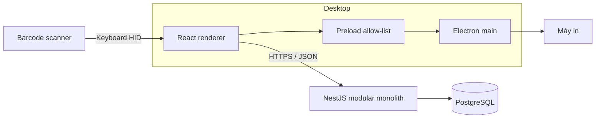
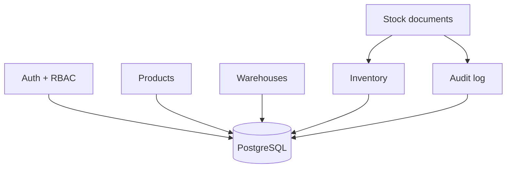

# Kiến trúc InventoryPro

## Mục tiêu

InventoryPro là ứng dụng desktop Windows-first, online-first cho một công ty có nhiều kho.
Server là nguồn dữ liệu chuẩn; desktop không tự quyết định tồn kho hợp lệ.

## Sơ đồ hệ thống

## Module backend

Đây là modular monolith: mỗi module sở hữu controller, service và quy tắc nghiệp vụ của
mình, nhưng được deploy trong một process. Chỉ tách microservice khi có nhu cầu scale hoặc
ownership độc lập đã được chứng minh.

## Quy tắc tồn kho

1. `StockLedger` là lịch sử bất biến.
2. `StockBalance` là projection để đọc nhanh.
3. Chỉ phiếu `APPROVED` mới được post.
4. Ghi ledger, cập nhật balance, đổi trạng thái và ghi audit chạy trong cùng transaction
   `SERIALIZABLE`.
5. Phiếu đã `POSTED` không được sửa hoặc xóa. Việc hiệu chỉnh phải sinh chứng từ đảo.
6. `idempotencyKey` chặn yêu cầu tạo phiếu bị gửi lặp.
7. Xuất kho dùng conditional update để không thể âm kho do concurrent request.

## Ranh giới bảo mật Electron

- Renderer không có Node.js.
- `contextIsolation` và sandbox được bật.
- Chỉ API native đã định nghĩa trong preload được expose.
- Refresh token được mã hóa bằng `safeStorage`.
- Access token chỉ nằm trong memory của renderer.
- Mọi dữ liệu từ renderer vẫn phải được backend xác thực và phân quyền.

## Quyết định chưa đưa vào MVP

- Offline write và đồng bộ hai chiều.
- POS, kế toán, hóa đơn điện tử.
- Quản lý lô, hạn sử dụng và serial.
- Microservices, Kafka hoặc Kubernetes.

Các mục này cần ADR riêng trước khi triển khai vì làm thay đổi đáng kể mô hình dữ liệu.
