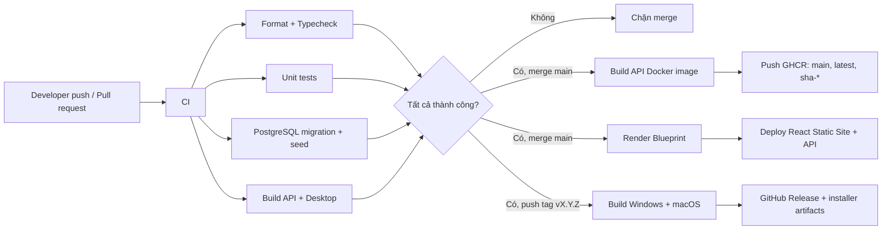

# CI/CD

## Luồng triển khai



## Workflow

| File                  | Kích hoạt                                 | Kết quả                                             |
| --------------------- | ----------------------------------------- | --------------------------------------------------- |
| `ci.yml`              | Pull request và push vào `main`/`develop` | Kiểm tra chất lượng, migration, seed, test và build |
| `backend-image.yml`   | Push `main`, tag hoặc chạy thủ công       | Push API image lên GitHub Container Registry        |
| `release-desktop.yml` | Tag semantic version `vX.Y.Z`             | Build Windows/macOS và tạo GitHub Release           |
| `pages.yml`           | Chạy thủ công                             | GitHub Pages dự phòng khi repository hỗ trợ Pages   |
| `render.yaml`         | Render Blueprint sync sau khi CI xanh     | Deploy React Static Site, API và PostgreSQL         |

Các workflow dùng quyền tối thiểu: CI chỉ đọc source; container chỉ được ghi package;
release chỉ được ghi nội dung release.

## Quy trình làm việc

```bash
git checkout -b feature/ten-tinh-nang
# code và test
npm run format:check
npm run typecheck
npm test
npm run build
git push -u origin feature/ten-tinh-nang
```

Mở pull request vào `develop` hoặc `main`. Chỉ merge khi workflow `CI` xanh.

## Phát hành desktop

Đồng bộ trường `version` trong root và `apps/desktop/package.json`, sau đó:

```bash
git tag -a v0.1.0 -m "InventoryPro v0.1.0"
git push origin v0.1.0
```

Workflow sẽ tạo:

- Windows: bộ cài Squirrel `.exe`, `.nupkg` và metadata cập nhật.
- macOS: file `.zip` của ứng dụng.

Các artifact hiện chưa được code-sign. Trước khi phát hành ra ngoài công ty cần cấu
hình chứng thư Windows, Apple Developer ID và notarization bằng GitHub Secrets.

## Backend container

Sau mỗi lần merge vào `main`, image được publish với ba dạng tag:

```text
ghcr.io/<owner>/inventory-api:main
ghcr.io/<owner>/inventory-api:latest
ghcr.io/<owner>/inventory-api:sha-<commit>
```

Khi phát hành `v0.1.0`, image có thêm tag `v0.1.0`. Môi trường production nên pin
theo tag phiên bản hoặc SHA, không pin `latest`.

Deployment server cần tự cung cấp `DATABASE_URL`, `JWT_ACCESS_SECRET`,
`JWT_ACCESS_TTL`, `REFRESH_TOKEN_TTL_DAYS` và `CORS_ORIGINS`. Chạy
`npm run db:deploy` trước khi chuyển traffic sang image mới.

## Thiết lập GitHub repository

Trong **Settings → Actions → General**:

1. Cho phép GitHub Actions chạy.
2. Workflow permissions có thể để mặc định read-only; từng workflow đã khai báo
   quyền `packages: write` hoặc `contents: write` đúng phạm vi.
3. Bật branch protection cho `main`, yêu cầu status check `CI / verify` và ít nhất
   một approval trước khi merge.
