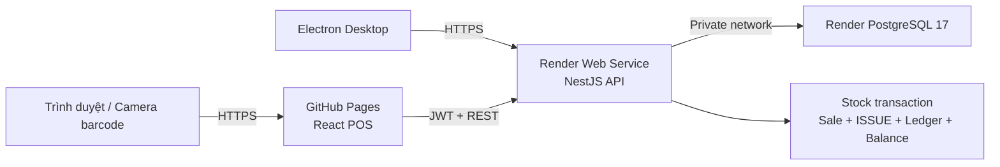

# Triển khai web, API và database

## Kiến trúc



GitHub Pages phục vụ React POS, còn Render Web Service chạy NestJS và PostgreSQL
lưu dữ liệu. Cả web và Electron gọi chung một API cloud, vì vậy số tồn luôn đến từ
một nguồn dữ liệu.

## 1. Tạo API và PostgreSQL trên Render

Repository có sẵn `render.yaml`. Mở:

[Deploy to Render](https://render.com/deploy?repo=https://github.com/tuyen12081707/inventory-desktop-suite-source)

Trong màn hình Blueprint:

1. Kết nối tài khoản GitHub có quyền đọc repository.
2. Nhập `SEED_ADMIN_PASSWORD` mạnh, tối thiểu 12 ký tự.
3. Xác nhận tạo `inventory-pro-api-tuyen12081707` và PostgreSQL.
4. Chờ health check `/api/v1/health` trả về `database: up`.

Trên free tier, container tự chạy migration và seed idempotent trước khi khởi động
API. Nếu `SEED_ADMIN_PASSWORD` được cấu hình, mỗi lần deploy sẽ đồng bộ mật khẩu
admin theo giá trị này. Production trả phí nên chuyển migration trở lại
`preDeployCommand` để tách migration khỏi tiến trình phục vụ API.

> Gói Render Postgres miễn phí phù hợp để test nhưng hết hạn sau 30 ngày và không có
> backup. Dữ liệu công ty phải dùng database trả phí, backup hằng ngày và kiểm tra
> restore định kỳ.

API mặc định:

```text
https://inventory-pro-api-tuyen12081707.onrender.com/api/v1
```

Nếu Render cấp hostname khác, tạo repository variable `VITE_API_URL` trong
**Settings → Secrets and variables → Actions → Variables** với giá trị URL API đầy đủ.

## 2. Bật GitHub Pages

Repository phải để public hoặc tài khoản GitHub phải hỗ trợ Pages cho private
repository. Vào **Settings → Pages → Build and deployment**, chọn
**Source: GitHub Actions**.

Web mặc định:

```text
https://tuyen12081707.github.io/inventory-desktop-suite-source/
```

Workflow `Web App` tự chạy sau khi CI trên `main` thành công, build React với API
URL ở trên rồi deploy GitHub Pages. `HashRouter` cho phép mở và refresh các route
như `#/pos` mà không cần rewrite.

## 3. CORS

Production API chỉ chấp nhận các origin khai báo trong `CORS_ORIGINS`. Giá trị mẫu:

```text
https://tuyen12081707.github.io,http://localhost:5173,file://
```

Nếu đổi domain, cập nhật biến môi trường trên Render và redeploy.

## 4. Kiểm tra sau deploy

1. Mở endpoint `/api/v1/health`.
2. Đăng nhập web bằng `SEED_ADMIN_EMAIL` và password đã nhập khi tạo Blueprint.
3. Chọn **Bán hàng POS**.
4. Quét barcode `893001000003` hai lần.
5. Thanh toán và xác nhận tồn kho giảm đúng 2.
6. Kiểm tra phiếu `ISSUE` tương ứng trong **Phiếu kho**.

Camera browser chỉ hoạt động trong secure context HTTPS. Máy quét barcode USB hoạt
động như bàn phím: gửi chuỗi mã và phím Enter.
