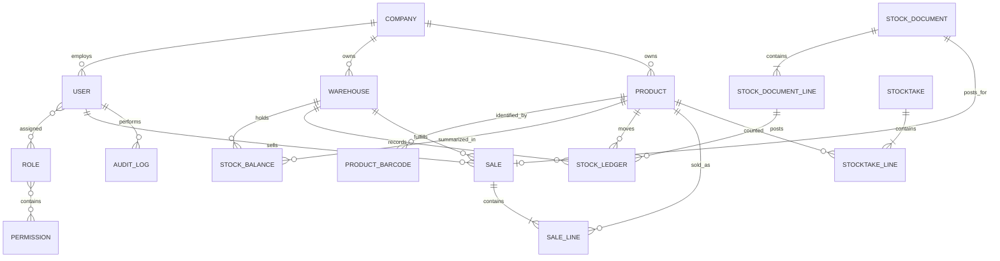

# Mô hình dữ liệu lõi

```mermaid
erDiagram
  COMPANY ||--o{ USER : employs
  COMPANY ||--o{ WAREHOUSE : owns
  COMPANY ||--o{ PRODUCT : owns
  USER }o--o{ ROLE : assigned
  ROLE }o--o{ PERMISSION : contains

  PRODUCT ||--o{ PRODUCT_BARCODE : identified_by
  PRODUCT ||--o{ STOCK_BALANCE : summarized_in
  WAREHOUSE ||--o{ STOCK_BALANCE : holds

  STOCK_DOCUMENT ||--|{ STOCK_DOCUMENT_LINE : contains
  STOCK_DOCUMENT_LINE ||--o{ STOCK_LEDGER : posts
  PRODUCT ||--o{ STOCK_LEDGER : moves
  WAREHOUSE ||--o{ STOCK_LEDGER : records

  SALE ||--|{ SALE_LINE : contains
  PRODUCT ||--o{ SALE_LINE : sold_as
  WAREHOUSE ||--o{ SALE : fulfills
  USER ||--o{ SALE : sells
  STOCK_DOCUMENT ||--o| SALE : posts_for

  STOCKTAKE ||--|{ STOCKTAKE_LINE : contains
  PRODUCT ||--o{ STOCKTAKE_LINE : counted
  USER ||--o{ AUDIT_LOG : performs
```

Schema triển khai đầy đủ nằm tại `apps/api/prisma/schema.prisma`.
