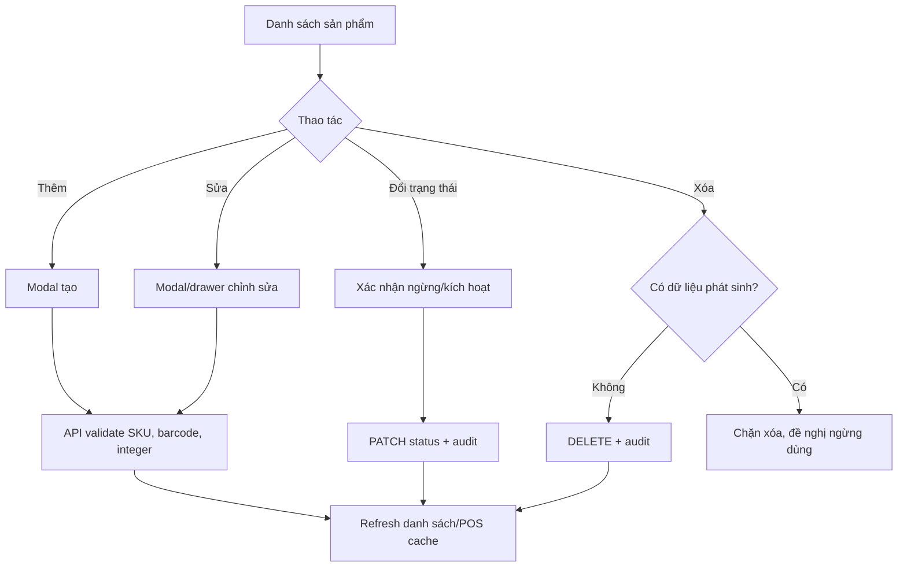
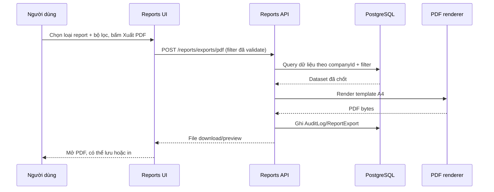
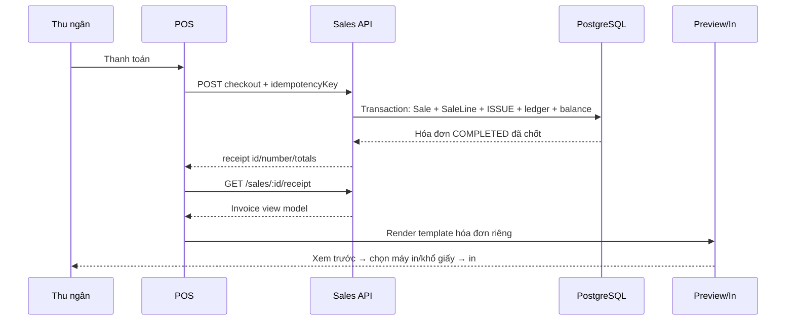

# Kế hoạch mở rộng InventoryPro

> Trạng thái: đề xuất triển khai  
> Cập nhật: 23/07/2026  
> Phạm vi: sản phẩm, báo cáo, cài đặt doanh nghiệp/tài khoản, PDF, in hóa đơn, UI responsive và quét barcode trên điện thoại.

## 1. Kết quả cần đạt

Sau đợt này, hệ thống phải vận hành theo các nguyên tắc sau:

- Sản phẩm có thể **tạo, sửa, đổi trạng thái sử dụng và xóa an toàn**. Không được mất lịch sử bán hàng, phiếu kho hoặc sổ tồn.
- Mọi số lượng hàng hóa là **số nguyên dương**; giao diện không còn hiển thị `22.000` hay cho nhập `1.5`.
- Có một màn **Báo cáo & phân tích** có bộ lọc thời gian/kho, biểu đồ và drill-down ra dữ liệu nguồn.
- Xuất PDF tạo **tài liệu báo cáo đúng khổ A4**, có thông tin công ty, phạm vi lọc, bảng dữ liệu và phân trang; không chụp/in nguyên màn hình ứng dụng.
- Thanh toán POS sinh **hóa đơn chuyên dụng**, xem trước được và in ra máy in nhiệt/A4. Nút in chung của ứng dụng không còn là cách in hóa đơn.
- Có trang **Cài đặt** để đổi tên doanh nghiệp, ảnh/logo, địa chỉ, điện thoại, email, tiền tệ/thuế/mẫu in; người dùng hiện tại có thể đổi mật khẩu an toàn.
- Bản web có thể dùng tốt trên điện thoại; camera barcode hoạt động qua HTTPS khi người dùng cấp quyền. Electron desktop vẫn giữ trải nghiệm rộng hơn.

## 2. Hiện trạng và khoảng trống

| Hạng mục | Hiện trạng                                                         | Vấn đề cần xử lý                                                         |
| -------- | ------------------------------------------------------------------ | ------------------------------------------------------------------------ |
| Sản phẩm | API đã có `POST`, `PATCH`; UI chỉ có modal thêm mới.               | Thiếu sửa, đổi trạng thái, xóa; không có cảnh báo hậu quả.               |
| Số lượng | DB `Decimal(18,3)`, Zod số thực, các `InputNumber precision={3}`.  | Cho nhập số lẻ và định dạng hiện `22.000`.                               |
| Báo cáo  | Chưa có route, module API hoặc dữ liệu report.                     | Chưa có KPI, biểu đồ, drill-down, export thực.                           |
| In       | `printCurrentWindow()` gọi `webContents.print()`/`window.print()`. | Nút “In hóa đơn” hiện in toàn bộ POS/modal; không phải chứng từ hóa đơn. |
| Cài đặt  | Chưa có model, route hoặc màn settings.                            | Tên công ty đang seed cứng; chưa có logo/mẫu in/đổi mật khẩu.            |
| Mobile   | `body` và Electron đang ép bề rộng tối thiểu 1000/1100px.          | Bị tràn, xuống dòng và không thể dùng POS tốt trên điện thoại.           |

## 3. Quyết định nghiệp vụ cần chốt

### 3.1 Sản phẩm: xóa an toàn, không xóa sai lịch sử

1. **Ngừng sử dụng** là thao tác mặc định: đặt `Product.active = false`. Sản phẩm bị ngừng sẽ không xuất hiện ở POS, không được thêm vào phiếu kho mới, nhưng vẫn thấy trong lịch sử và báo cáo.
2. **Xóa vĩnh viễn** chỉ hiển thị cho người có quyền `products.delete`, và chỉ thành công khi sản phẩm chưa có barcode, số dư tồn, dòng phiếu kho, ledger, kiểm kê hoặc dòng bán hàng. Nếu đã phát sinh, API trả lỗi rõ ràng và UI hướng dẫn dùng “Ngừng sử dụng”.
3. Sửa SKU/barcode phải kiểm tra duy nhất theo công ty. Không sửa tồn hiện tại trực tiếp từ trang sản phẩm; phải dùng phiếu điều chỉnh để giữ ledger bất biến.
4. Đổi trạng thái cần modal xác nhận. Khi ngừng dùng, hiển thị số tồn đang còn và cảnh báo cần xử lý tồn trước khi ngừng bán nếu còn hàng.

### 3.2 Số lượng là integer

`quantity`, `reorderPoint`, `expectedQty`, `countedQty`, `stockTotal` và số lượng line POS/phiếu kho sẽ là `Int`; giá tiền vẫn là `Decimal` để không mất độ chính xác tiền tệ.

- UI: dùng `precision={0}`, `step={1}`, parser chỉ chấp nhận nguyên; format dùng `Intl.NumberFormat('vi-VN', { maximumFractionDigits: 0 })`.
- API: Zod dùng `z.coerce.number().int()`; nhập/xuất/chuyển kho > 0, điều chỉnh khác 0, POS > 0.
- DB: migration đổi tất cả cột số lượng từ `Decimal(18,3)` sang `Integer` bằng `USING round(column)::integer`.
- **Điều kiện chạy migration:** chạy truy vấn kiểm tra trước. Nếu có bất kỳ số lượng lẻ nào, migration phải dừng và xuất danh sách dữ liệu cần quyết định (làm tròn, tách đơn vị hay giữ Decimal cho một loại hàng). Không được âm thầm làm tròn.

### 3.3 Cài đặt và tài khoản

- Chỉ người có `settings.manage` được chỉnh thông tin doanh nghiệp và mẫu in.
- Logo chỉ nhận PNG/JPEG/WebP, giới hạn 2 MB; server tối ưu ảnh và lưu object storage/local storage theo môi trường. DB chỉ lưu URL/key, không nhét base64 vào bảng `Company`.
- Người dùng đăng nhập chỉ đổi được mật khẩu của chính họ. Bắt buộc nhập mật khẩu hiện tại, mật khẩu mới tối thiểu 12 ký tự, xác nhận lại; sau khi đổi thì thu hồi tất cả refresh token cũ và yêu cầu đăng nhập lại.
- Quản lý tài khoản/role người khác là phase tùy chọn; không tự thêm nếu chưa cần, vì sẽ mở rộng quyền và luồng bảo mật đáng kể.

### 3.4 In và PDF

- **In màn hình** chỉ giữ cho mục đích hỗ trợ/nội bộ, đổi tên thành “In trang hiện tại”; không dùng cho hóa đơn hoặc báo cáo chính thức.
- Hóa đơn và báo cáo có template HTML chuyên dụng, render tách khỏi layout ứng dụng. Desktop gửi HTML đó tới một `BrowserWindow` ẩn/print job; web mở preview in riêng.
- PDF báo cáo được API tạo từ dữ liệu server đã chốt theo bộ lọc. File nhận được luôn là A4 và có header/footer/số trang, không phụ thuộc vào viewport của người dùng.
- Hóa đơn không phải hóa đơn điện tử/VAT hợp pháp. Nếu cần ký số/kết nối cơ quan thuế, cần ADR và tích hợp nhà cung cấp riêng.

## 4. Thiết kế dữ liệu và API

### 4.1 Migration Prisma

1. Chuyển các trường số lượng:
   - `Product.reorderPoint`
   - `StockBalance.quantity`
   - `StockDocumentLine.quantity`
   - `StockLedger.quantityDelta`, `StockLedger.balanceAfter`
   - `StocktakeLine.expectedQty`, `StocktakeLine.countedQty`
   - `SaleLine.quantity`
2. Bổ sung vào `Company`: `logoKey?`, `address?`, `phone?`, `email?`, `taxCode?`, `currencyCode` (mặc định `VND`), `defaultTaxRate`, `receiptPaperSize` (`THERMAL_80 | A4`), `receiptFooter?`.
3. Tạo `ReportExport` để audit export (người tạo, loại report, filter JSON, khoảng thời gian, thời điểm), không lưu nội dung PDF trừ khi nghiệp vụ yêu cầu lưu trữ.
4. Tạo migration có preflight kiểm tra số lẻ và script rollback/backup được ghi trong release checklist.

### 4.2 API đề xuất

| Method      | Endpoint                 | Quyền             | Mục đích                                                    |
| ----------- | ------------------------ | ----------------- | ----------------------------------------------------------- |
| `GET`       | `/products/:id`          | `products.read`   | Lấy chi tiết để mở modal/drawer sửa.                        |
| `PATCH`     | `/products/:id`          | `products.write`  | Cập nhật thông tin; không chỉnh tồn.                        |
| `PATCH`     | `/products/:id/status`   | `products.write`  | Bật/tắt sử dụng, ghi audit.                                 |
| `DELETE`    | `/products/:id`          | `products.delete` | Xóa vĩnh viễn khi chưa có tham chiếu.                       |
| `GET`       | `/reports/overview`      | `reports.read`    | KPI và chuỗi dữ liệu biểu đồ theo filter.                   |
| `GET`       | `/reports/inventory`     | `reports.read`    | Chi tiết tồn, giá trị, hàng sắp hết/chậm luân chuyển.       |
| `GET`       | `/reports/sales`         | `reports.read`    | Chi tiết doanh thu, top sản phẩm, phương thức thanh toán.   |
| `POST`      | `/reports/exports/pdf`   | `reports.export`  | Tạo/stream PDF theo report + filter; audit export.          |
| `GET`       | `/sales/:id/receipt`     | `sales.read`      | Dữ liệu hóa đơn đã chốt, gồm snapshot công ty và từng dòng. |
| `GET/PATCH` | `/settings/company`      | `settings.manage` | Đọc/cập nhật thông tin doanh nghiệp.                        |
| `POST`      | `/settings/company/logo` | `settings.manage` | Upload logo qua multipart, trả URL/key.                     |
| `PATCH`     | `/auth/me/password`      | đăng nhập         | Đổi mật khẩu và thu hồi phiên cũ.                           |

Mọi route ghi dữ liệu phải phân quyền, validate Zod, scope `companyId`, transaction khi cần và ghi `AuditLog` với before/after. Seed thêm các quyền `products.delete`, `reports.read`, `reports.export`, `settings.manage`.

## 5. Flow màn hình

### 5.1 Sản phẩm

Màn danh sách thêm cột thao tác cố định: **Sửa**, **Ngừng dùng/Kích hoạt**, **Xóa**. Bảng desktop có scroll ngang thay vì ép chữ xuống dòng; mobile chuyển thành card có SKU, tồn, giá và menu `…`.

Modal sửa dùng chung form tạo, có tiêu đề đúng ngữ cảnh và validation realtime. Với số lượng/ngưỡng tồn chỉ chấp nhận `0, 1, 2…`; giá hiển thị theo VND, không dùng số thập phân.

### 5.2 Báo cáo & phân tích

Trang mới `/reports` có bộ lọc đồng nhất: khoảng ngày (hôm nay/7 ngày/tháng này/tùy chọn), kho, nhóm hàng và trạng thái sản phẩm. Áp dụng filter bằng nút “Cập nhật”; URL lưu query để chia sẻ/refresh không mất ngữ cảnh.

| Khối                      | Dữ liệu                                           | Tương tác                                                  |
| ------------------------- | ------------------------------------------------- | ---------------------------------------------------------- |
| KPI                       | Doanh thu, lợi nhuận gộp, số hóa đơn, giá trị tồn | So với kỳ trước cùng độ dài; tooltip giải thích công thức. |
| Doanh thu theo ngày/tháng | `Sale.soldAt`, total/discount/tax                 | Bấm cột/điểm để lọc bảng hóa đơn nguồn.                    |
| Top sản phẩm              | số lượng, doanh thu, lợi nhuận gộp                | Bấm sản phẩm mở chi tiết/sổ biến động.                     |
| Cơ cấu tồn                | giá trị theo nhóm hàng/kho                        | Bấm segment để lọc bảng tồn.                               |
| Cảnh báo tồn              | sắp hết, hết hàng, không luân chuyển              | Bấm để vào danh sách tồn đã lọc.                           |
| Bảng chi tiết             | hàng tồn/doanh số/phiếu gần đây                   | phân trang server-side, export đúng filter hiện tại.       |

`Lợi nhuận gộp = doanh thu trước thuế - giảm giá - giá vốn xuất thực tế`. Nếu hiện tại chỉ có `averageCost`, report phải dùng giá vốn snapshot/ledger của lúc bán; không lấy `Product.standardCost` hiện tại để tính ngược lịch sử. Vì vậy phase báo cáo cần bổ sung `unitCost`/`costTotal` snapshot vào `SaleLine` nếu dữ liệu hiện hữu chưa đủ.

### 5.3 Xuất PDF báo cáo

Mẫu PDF gồm: logo/tên/thông tin công ty, tiêu đề report, khoảng thời gian/kho/bộ lọc, thời điểm xuất + người xuất, KPI, biểu đồ (SVG/PNG), bảng chi tiết, tổng cộng, số trang. Nếu dữ liệu quá lớn, PDF phân trang; CSV/XLSX là phase sau để xuất dữ liệu thô.

### 5.4 Thanh toán và in hóa đơn

Sau khi checkout thành công, modal có: **Xem hóa đơn**, **In ngay**, **Tạo giao dịch mới**. Không in app shell hoặc giỏ hàng.

Nội dung hóa đơn: logo/tên/cửa hàng, địa chỉ/điện thoại/mã số thuế nếu có, số hóa đơn, ngày giờ, thu ngân, kho/quầy, khách hàng, bảng SKU–tên–SL–đơn giá–thành tiền, tạm tính, giảm giá, VAT, tổng thanh toán, phương thức thanh toán, QR/Barcode số hóa đơn (tùy chọn), footer cảm ơn/chính sách đổi trả. Template hỗ trợ 80 mm và A4, CSS print cố định, không lệ thuộc màn hình.

## 6. Responsive và barcode trên điện thoại

### Breakpoint và layout

| Viewport     | Điều chỉnh bắt buộc                                                                                                                 |
| ------------ | ----------------------------------------------------------------------------------------------------------------------------------- |
| `>= 1280px`  | Sidebar 236px, bảng đủ cột, POS 2 cột.                                                                                              |
| `768–1279px` | Sidebar thu gọn/collapsible; bảng scroll ngang; POS cart 370px hoặc drawer.                                                         |
| `< 768px`    | Header gọn + menu drawer; padding 12–16px; card grid 1 cột; bảng chuyển card/list; modal full-screen; thao tác chạm tối thiểu 44px. |
| `< 480px`    | POS catalog toàn màn; giỏ hàng mở bottom sheet; nút thanh toán sticky; form 1 cột; không để text/giá bị overflow.                   |

Việc thực hiện gồm bỏ `min-width: 1000px` ở CSS cho web, tách cấu hình cửa sổ Electron (`minWidth` chỉ áp dụng desktop), dùng `Responsive` của Ant Design và media query thật. Test trên 320, 375, 390, 412, 768, 1024, 1280 và 1440px; ưu tiên iPhone SE, iPhone 14/15 và Android 360/412px.

### Barcode camera

- Tái sử dụng `BarcodeScannerModal` hiện có (`@zxing/browser`), đã xin camera sau thao tác người dùng và ưu tiên camera sau (`environment`).
- Trên mobile web bắt buộc HTTPS hoặc `localhost`; hiển thị hướng dẫn/callback khi bị từ chối quyền, không block nhập barcode/SKU thủ công hay máy quét Bluetooth/HID.
- Chỉ quét các chuẩn cần dùng (EAN-13/EAN-8, Code 128, UPC-A); debounce kết quả, rung nhẹ/thông báo thành công nếu browser hỗ trợ.
- Kiểm thử trên Chrome Android và Safari iOS thật. Đây là chức năng phụ: POS và nhập tay phải hoàn chỉnh trước khi tối ưu camera.

## 7. Lộ trình triển khai và tiêu chí nghiệm thu

### Phase 0 — Khảo sát và bảo toàn dữ liệu

1. Backup database, kiểm tra số lượng có phần thập phân và thống kê số record bị ảnh hưởng.
2. Chốt tên doanh nghiệp, thông tin in, đơn vị tiền tệ, thuế mặc định, khổ máy in nhiệt và chính sách xóa sản phẩm.
3. Viết ADR cho integer quantity, xóa mềm/vĩnh viễn và PDF/in; tạo dữ liệu fixture cho report/in.

**Xong khi:** có backup khôi phục thử thành công và quyết định xử lý toàn bộ dữ liệu số lẻ được ký duyệt.

### Phase 1 — Nền tảng sản phẩm và số nguyên

1. Migration Int + Zod/contracts/service/test; cập nhật toàn bộ POS, phiếu kho, kiểm kê, seed và formatter.
2. Bổ sung Product detail/update/status/delete, audit, permission và UI action/menu xác nhận.
3. Test boundary: 0, 1, số lớn, số lẻ, hàng còn tồn, hàng đã bán, barcode/SKU trùng, hai request cùng lúc.

**Xong khi:** không API/UI nào nhận số lẻ; không thấy `.000`; không thể xóa sản phẩm đã có lịch sử; POS loại sản phẩm ngừng dùng.

### Phase 2 — Settings và bảo mật tài khoản

1. Company settings, upload logo an toàn, quyền settings và màn hình `/settings`.
2. Đổi mật khẩu có current-password check, password policy, revoke refresh tokens, audit.
3. Nạp settings vào header, PDF và hóa đơn (logo fallback là chữ viết tắt).

**Xong khi:** admin đổi tên/logo và thấy thay đổi trong app/print; đổi mật khẩu làm session cũ không dùng được.

### Phase 3 — Hóa đơn chuyên dụng và in

1. Endpoint receipt view model, template HTML print 80mm/A4, preview route/window và IPC print payload thay vì current window.
2. Luồng POS sau checkout, reprint từ danh sách hóa đơn (nếu thêm lịch sử bán hàng), test print CSS/PDF snapshot.
3. Đổi nút toàn cục thành “In trang hiện tại” hoặc bỏ khỏi các màn không phù hợp.

**Xong khi:** preview chỉ chứa hóa đơn, không có sidebar/POS UI; máy in nhận đúng khổ, số tiền/tổng khớp Sale đã chốt.

### Phase 4 — Reports, PDF và drill-down

1. Module Reports, aggregate query có index, contracts, role permissions và audit export.
2. UI report/filter/chart/table/detail; đảm bảo timezone `Asia/Ho_Chi_Minh` khi gom ngày/tháng.
3. PDF renderer (ví dụ Playwright/Chromium server-side) + template A4, tải file an toàn và load/performance test.

**Xong khi:** số KPI truy vết được về sale/ledger, filter đồng nhất trên UI/PDF, PDF nhiều trang không cắt bảng và không phải screenshot.

### Phase 5 — Responsive và mobile barcode

1. Refactor layout/header/nav/table/form/POS theo breakpoints; sửa overflow và xuống dòng.
2. Browser/device test + camera barcode; accessibility keyboard/touch/zoom.
3. Optional: PWA install prompt và offline read cache, không cho offline checkout trong phase này.

**Xong khi:** toàn bộ tuyến Dashboard → Products → POS → Settings → Reports dùng được ở 320–412px, không horizontal overflow ngoài vùng bảng được chỉ định, và barcode camera có fallback rõ ràng.

## 8. Kiểm thử và vận hành

- Unit test: schema integer, product deletion guard, status guard, công thức report, tổng invoice, password change/revocation.
- Integration test: migration preflight, tenant isolation, RBAC, PDF filter, checkout idempotency, reprint đúng dữ liệu chốt.
- E2E: tạo/sửa/ngừng/xóa sản phẩm; bán hàng → preview → in; report → drill-down → PDF; mobile scan → cart → checkout.
- Visual regression: desktop/mobile cho Products, POS, Reports, Settings, invoice A4 và thermal 80mm.
- Observability: log lỗi render PDF/print/camera không chứa PII; audit mọi export, thay settings, xóa/đổi trạng thái sản phẩm và đổi mật khẩu.
- Release: feature flag cho Reports/PDF nếu cần, canary với bản sao DB, rollback app + DB theo ADR; migration quantity chỉ chạy sau backup và preflight xanh.

## 9. Thứ tự ưu tiên đề xuất

1. **P0:** integer quantity + sản phẩm (sửa/trạng thái/xóa an toàn) + sửa layout overflow.
2. **P1:** settings doanh nghiệp/đổi mật khẩu + hóa đơn/print template.
3. **P2:** reports chi tiết + PDF chuẩn.
4. **P3:** tối ưu mobile đầy đủ và scan barcode camera; đây là phần phụ nhưng kiến trúc phase trước không được chặn nó.

## 10. Câu hỏi cần xác nhận trước khi code Phase 0/1

1. Có sản phẩm nào thực sự cần bán/nhập theo lẻ (kg, mét, lít) không? Nếu có, không thể đổi toàn hệ thống sang integer mà cần `quantityMode` theo sản phẩm.
2. “Xóa” có được phép xóa vĩnh viễn chỉ với sản phẩm chưa phát sinh như đề xuất không, hay chỉ muốn archive/ngừng dùng?
3. Hóa đơn cần máy in nhiệt 58mm, 80mm hay A4; có cần QR thanh toán hoặc hóa đơn VAT/điện tử không?
4. Report cần tính lợi nhuận theo giá vốn bình quân hiện tại hay bắt buộc giá vốn được chốt tại thời điểm bán? Kế hoạch đề xuất phương án chốt thời điểm bán để số liệu lịch sử không đổi.
